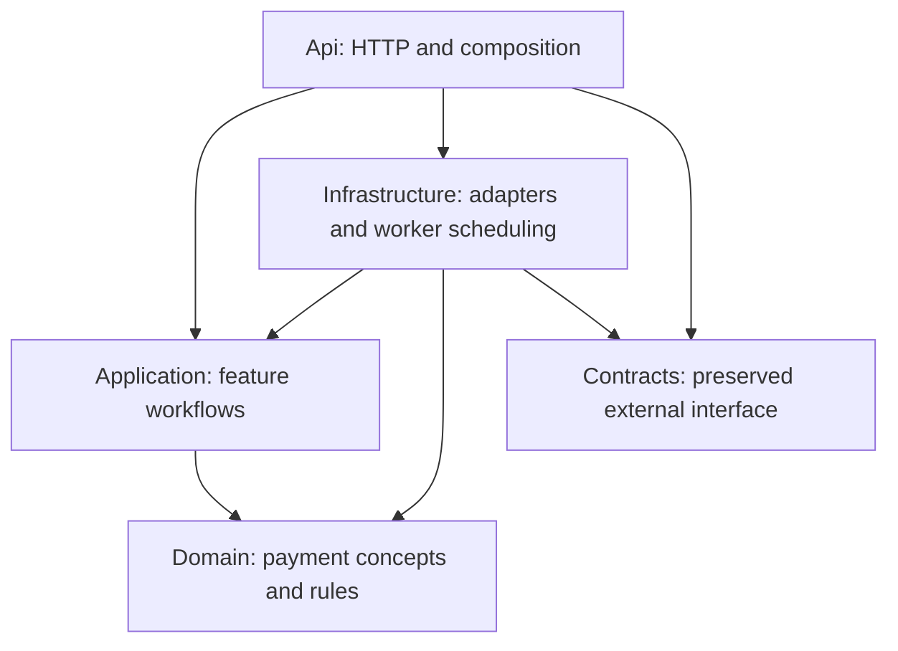

# Architecture

## One host, separate layers

The Api executable runs HTTP endpoints and, once implemented, the background workers. Separate libraries make dependency direction checkable without introducing a second deployment.

| Project | Direct project references | Owns |
|---|---|---|
| IPS.MiidleWear.Contracts | None | Existing public models, interfaces, route constants, metadata |
| IPS.Middleware.Domain | None | Payment concepts, invariants, transaction state transitions |
| IPS.Middleware.Application | Domain | Internal commands/results, feature workflows, external dependency interfaces |
| IPS.Middleware.Infrastructure | Application, Domain, Contracts | EF/SQL, XML, signing/TLS, HTTP adapters, telemetry, hosted scheduling |
| IPS.Middleware.Api | Application, Infrastructure, Contracts | HTTP mapping, configuration, dependency registration |
| IPS.Middleware.Tests | Contracts; Api as a build dependency only | Compatibility and evaluated dependency tests; later core behavior tests |
| IPS.Middleware.IntegrationTests | Api | Host and adapter tests; later independent protocol simulators |

Contracts and Domain use only the base class library. Application also has no external packages in the foundation. A future pure-library dependency needs a reviewed rule change; ASP.NET, EF Core, HTTP clients, hosting, signing, and telemetry implementations remain outside Application.

Transitive project references are disabled, so access to another project's types requires an explicit reference. Architecture tests inspect manifests produced from **evaluated MSBuild references**, including imported package/framework references and resolved non-framework assembly references. This catches changes hidden in build imports or direct DLL references rather than checking only visible project-file text.

## Feature ownership

Future folders follow the capability rather than a generic Services/Managers taxonomy:

- Application: payment submission, dispatch decisions, recovery, incoming handling, status delivery, recalls, initiations, proxy management.
- Domain: only concepts and rules those capabilities actually need. ISO XML models and database-only records belong in Infrastructure.
- Infrastructure: HTTP/core/IPS/proxy adapters, protocol encoding/parsing/signing, persistence, and Workers.
- Api: request/response translation and endpoint mapping.

Api converts external DTOs into application commands. Infrastructure converts application requests/results into the existing core-facing DTOs or IPS messages. Application does not reference Contracts, so external JSON details do not define the internal workflow.

Workers call application workflows; they do not own payment state or retry policy. Database state will be the durable source of pending work. Any in-memory wake-up mechanism is an optimization and must not become the only record of accepted work.

## Extension rule

Implement the first capability directly. Add a shared module when multiple implemented callers need the same behavior. Its interface should hide protocol or storage complexity and have meaningful tests through that interface. Avoid generic repositories, a mediation framework, or inheritance hierarchies introduced before the workflows justify them.

## Decisions

- [Single executable host](adr/0001-single-host.md)
- [Preserved external contracts](adr/0002-contract-compatibility.md)

Infrastructure is an empty library at this milestone. SQL Server and EF Core remain the selected persistence stack, introduced with the durable-storage capability and newly generated migrations.
