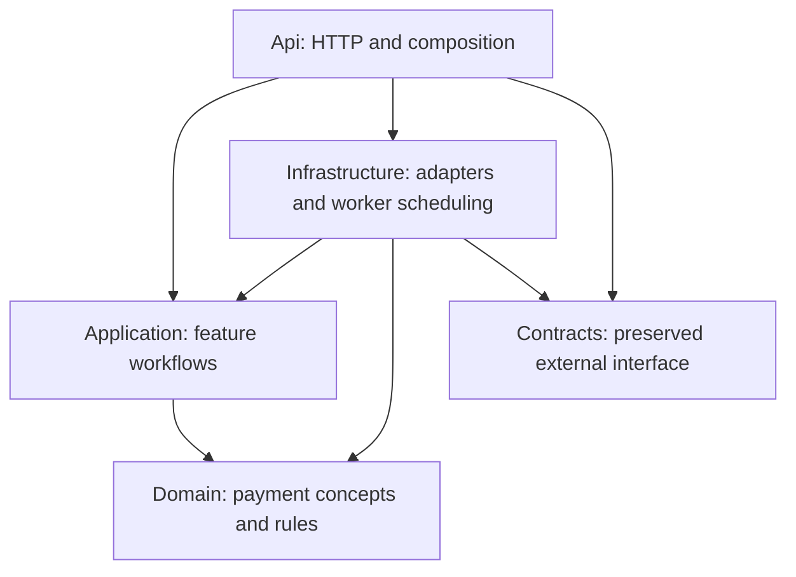

# Architecture

## One host, separate layers

The Api executable runs HTTP endpoints and, once implemented, the background workers. Separate libraries make dependency direction checkable without introducing a second deployment.

| Project | Direct project references | Owns |
|---|---|---|
| IPS.MiidleWear.Contracts | None | Existing public models, interfaces, route constants, metadata |
| IPS.Middleware.Domain | None | Payment concepts, invariants, transaction state transitions |
| IPS.Middleware.Application | Domain | Internal commands/results, feature workflows, external dependency interfaces |
| IPS.Middleware.Infrastructure | Application, Domain, Contracts | EF/SQL, XML, signing/TLS, HTTP adapters, telemetry, hosted scheduling |
| IPS.Middleware.Api | Application, Infrastructure, Contracts | HTTP mapping, configuration, dependency registration |
| IPS.Middleware.Tests | Application, Domain, Contracts; Api as a build dependency only | Domain/application behavior, compatibility, and evaluated dependency tests |
| IPS.Middleware.IntegrationTests | Api, Infrastructure, Application, Domain, Contracts | Host and SQL persistence tests; later independent protocol simulators |

Contracts uses only the base class library. Domain additionally allows the centrally pinned Stateless 5.20.1; its types remain private to transition implementation. Application allows centrally pinned FluentValidation 12.1.1 for explicitly invoked, composed input validation and resolves Stateless transitively through Domain. No ASP.NET validation integration is used. Any further pure-library dependency needs a reviewed rule change; ASP.NET, EF Core, HTTP clients, hosting, signing, and telemetry implementations remain outside Application.

Transitive project references are disabled, so access to another project's types requires an explicit reference. Architecture tests inspect manifests produced from **evaluated MSBuild references**, including imported package/framework references and resolved non-framework assembly references. This catches changes hidden in build imports or direct DLL references rather than checking only visible project-file text. The generated reports are copied into test output as hidden build inputs; they do not appear as linked files in Solution Explorer.

## Feature ownership

Future folders follow the capability rather than a generic Services/Managers taxonomy:

- Application: payment submission, dispatch decisions, recovery, incoming handling, status delivery, recalls, initiations, proxy management.
- Domain: only concepts and rules those capabilities actually need. ISO XML models and database-only records belong in Infrastructure.
- Infrastructure: HTTP/core/IPS/proxy adapters, protocol encoding/parsing/signing, persistence, and Workers.
- Api: request/response translation and endpoint mapping.

Api converts external DTOs into application commands. Infrastructure converts application requests/results into the existing core-facing DTOs or IPS messages. Application does not reference Contracts, so external JSON details do not define the internal workflow.

Workers call application workflows; they do not own payment state or retry policy. Database state will be the durable source of pending work. Any in-memory wake-up mechanism is an optimization and must not become the only record of accepted work.

## Extension rule

Implement the first capability directly. Add a shared module when multiple implemented callers need the same behavior. Its interface should hide protocol or storage complexity and have meaningful tests through that interface. Avoid generic repositories and a mediation framework. AggregateRoot is the approved minimal base for identity and pending domain events; add concrete payment aggregates only with implemented capabilities.

## Decisions

- [Single executable host](adr/0001-single-host.md)
- [Preserved external contracts](adr/0002-contract-compatibility.md)

Infrastructure directly maps OutgoingPayment current state and stores full versioned JSON events alongside it; loading state never replays history. Scoped transaction/work repositories and an explicit unit of work share one EF context. The version-checked parent is written before events in one transaction. A preparation-only interceptor adds event rows; events are acknowledged after commit and failed scopes are discarded. Request JSON, rowversion, ownership, and scheduling remain Infrastructure metadata. Domain business methods enforce transitions; Application owns workflow decisions. The Api registers persistence and workers when payment processing arrives. See [ADR 0003](adr/0003-aggregate-events.md) and [the approved outbound stages](rebuild-plan.md).

## Shared persistence

Application/Abstractions/Persistence owns IUnitOfWork and general concurrency/uniqueness exceptions. Application/Abstractions/Payments owns repository interfaces; workflow models remain with Transactions. Infrastructure/Repositories/Payments implements those interfaces. Inbound code is grouped by capability under Application/Inbound (Receipts, Registration, Processing, Pacs008); each inbound feature owns its ports, implemented by Infrastructure/Repositories/Inbound. Application/Abstractions keeps only Persistence and Payments. Infrastructure/UnitOfWork saves every tracked change through one scoped context and acknowledges AggregateRoot events after commit. DomainEventsInterceptor validates sequences and prepares aggregate identity and event records; PaymentPersistenceInterceptor enforces ownership and immutable payment storage rules. Intake interprets duplicate references.

Mappings and interceptors live under Infrastructure/Persistence. TransactionDbContext retains its historical CLR identity so existing generated migrations are still discovered. It is the shared database context; ordinary tracked entities save through the same unit of work. Historical migration paths and the schema remain unchanged. See [the revision specification](specs/001e-shared-unit-of-work.md).

## Outgoing preparation storage

Historical Stage 2a layout, superseded by the explicit outgoing journal below for send-ready messages. The accepted snapshot, identifiers and unsigned preparation checkpoint remain on Transactions.

Stage 2a.1 keeps generated protocol identifiers and two immutable XML slots in Infrastructure shadow metadata on Transactions. The existing rowversion fences artifact writes without a second concurrency mechanism. IPaymentPreparationRepository reads detached snapshots and stages exact content under the current claim; IUnitOfWork still owns commit. Metadata-only saves do not invent business events; changes to Domain properties continue to require pending events.

This small first capability stores XML alongside the parent, so tracked aggregate loads include those values. Separate artifact tables/projections can be considered with measured access patterns; no generic document subsystem is introduced. XML validation and cryptographic verification belong to the following protocol-preparation slice.

## Validation ownership

Api deserializes external contracts and maps Application input. Application validates once at entry; intake and processing receive validated input. Domain methods still enforce aggregate invariants/transitions. Infrastructure enforces persistence, schema and cryptographic constraints. Do not duplicate request-field validation in workflows or restore inline intake guards.

The current ValidatedIntakeRequest factory validates the foundation envelope only: required values, storage identifier lengths and normalization. It cannot be constructed or changed directly. Payment-specific validation will precede its creation as each capability is implemented; this is not yet a complete pacs.008 validator. Cancellation is propagated to dependencies, with test doubles honoring the same contract.
## pacs.008 preparation boundary

Application validates the request through composed FluentValidation validators, then constructs an immutable normalized ValidatedPacs008. Required values are non-nullable; treasury account selection and party kinds are resolved before protocol mapping. Raw address-line text is deliberately retained because the source splits it before trimming each segment. Existing camel-case, unindexed validation error paths and messages are preserved at the validation boundary.

Infrastructure's Pacs008Xml takes a validated payment and PaymentMessageContext. Immutable Pacs008ProtocolProfile settings are validated once at construction. Pacs008Message builds the supported profile directly with LINQ to XML: child order follows the XSD sequence in code, absent optional values are omitted, and dates/amounts are formatted explicitly to preserve the existing lexical profile. Serialization and XSD validation follow. No XML model classes, generic mapping framework or new interface is introduced.

A trial using dotnet-xscgen 3.0.1405 successfully generated both pinned schemas (199,475 bytes of C#); the full generated surface includes many unused ISO features and DateTime/Specified members that need adaptation for our exact lexical output. Stage 2a.2 first used smaller authored XmlSerializer profile models. On 2026-10-04 the owner requested a slimmer implementation, and those models were replaced by LINQ to XML construction; output was confirmed byte-identical across representative profiles before the switch. The builder must be tested against the unchanged XSDs and independent expectations. See the design research and 2a.2 specification.

## Signing boundary

Pacs008MessageSigner consumes stored unsigned XML and a caller-owned certificate, returning XML plus signed/unsigned disposition. It does not load certificate sources, write storage, send messages or drive state transitions. The Api creates the signing policy from finalized configuration; Payments:Signing:AllowUnsignedInDevelopment is false by default and forbidden outside Development. Missing certificates may be bypassed only through that policy; invalid supplied certificates fail.

The signature uses .NET cryptographic primitives with no process-wide CryptoConfig registrations. Inclusive C14N1.1 is supported only for the freshly generated SignedInfo profile without inherited xml:* attributes; those attributes are actively rejected and ancestor namespace bindings are included. This limited equivalence is independently checked by Java's JSR105 verifier, including extra and default namespace contexts. It is not advertised as a general canonicalization library. Production needs no Java runtime; the integration suite requires JDK17+ and CI provisions it. Certificate validity/key usage checks do not perform remote chain/revocation validation or establish IPS trust.

## Initial submission evidence

Historical Stage 2b layout: SignedXml, SubmissionJson and SubmissionResponseJson shadow columns are removed by Stage 2c.0. Their authoritative replacement is the explicit outgoing journal below.

Stage 2b.1 adds IPaymentSubmissionRepository using the same scoped context and unit of work. SubmissionJson stores the UTC submission marker, originating claim token and selected message disposition. SubmissionResponseJson stores the complete supplied HTTP status, decoded body and ordered headers without interpreting them. These are immutable Infrastructure shadow artifacts, protected by exact-value authorization and the parent rowversion.

Commit the selected artifact before staging submission and commit submission before remote I/O or response storage. An existing marker cannot authorize another initial send. Development unsigned disposition selects UnsignedXml without filling SignedXml; the workflow must enforce the existing environment-bound signing policy before dispatch. Responses require the original live submission owner. Preparation cannot add artifacts after submission begins.

This storage slice does not change recovery or add a sender. The next Application workflow must inspect marker/response evidence before deciding whether to prepare, interpret or investigate; the initial marker is not a retry-attempt history. See [the checkpoint specification](specs/002b1-submission-checkpoints.md).

## Resumable pacs.008 processing

Stage 2b.2 adds Pacs008Intake and Pacs008Processing in Application/Payments/Pacs008. Intake validates against current policy once, then the shared intake stores the request, identifiers and a versioned AcceptedPacs008 snapshot (normalized payment, Pacs008ProtocolProfile mapping settings, envelope time and submission deadline) in the AcceptedJson shadow column. The profile moved to Application because intake captures it; fixed protocol constants stay in Pacs008Message. Processing never consults current policy or mapping settings.

ProcessAsync acquires ownership, then resumes from committed checkpoints: unsigned XML, signed XML, submission marker, raw response, outcome. Each checkpoint is its own unit-of-work commit; a lost race ends the run with the last committed outcome. Only three Application interfaces exist for the variation: IPacs008MessagePreparation (XML and signing, deferring certificate problems), IIpsTransport and IIpsReplyInterpreter. Infrastructure implements preparation over the existing builder and signer, with ISigningCertificateSource as the seam until 2c configures certificate sources. IpsReplyInterpreter validates the pacs.002.001.14 reply, verifies the IPS signature profile against supplied trusted certificates and correlates identifiers before a final outcome.

Recovery releases abandoned pacs.008 preparation (no marker) and stored responses for the next owner without a status change; a marker without a response becomes Uncertain. Discovery includes unowned due Sending. See [the specification](specs/002b2-pacs008-processing.md).

## Incoming receipt foundations

InboundMessageJournal is Infrastructure persistence, independent of payment aggregates and TransactionEvents. Application owns validated envelope values, immutable snapshots, intake and ownership operations; the Receipts, Registration and Processing ports are implemented by Repositories/Inbound. All changes use the existing context and shared unit of work. Identity is normalized participant BIC + positive IPS sequence with binary SQL comparison; missing/nonpositive sequences are held. XML is immutable and unparsed at this boundary.

InboundReceiptRegistration creates a fresh scope for each bounded registration retry and notifies the local channel only after a successful new receipt commit. Rowversion conflicts and uniqueness races discard the failed scope. InboundWork commits ownership before returning a claim. A duplicate update can invalidate an owner's loaded rowversion; it must discard that scope and reload, never replay remote effects. InboundProcessingChannel carries IDs, is bounded/nonblocking and coalesces queued IDs locally. InboundWorkDiscovery refills from due SQL rows in bounded batches. No channel conveys ownership or replaces SQL, and no worker is activated by this foundation. See the [specification](specs/004a-inbound-foundations.md).

## Incoming payment identity

Stage 004b.2a adds the Domain IncomingPayment aggregate: normalized receiving participant BIC, exact EndToEndId and UTC registration time, with one IncomingPaymentRegistered event and no lifecycle placeholders. Its state lives in IncomingPayments, separate from outgoing Transactions. A persistence-only AggregateIdentities table holds every aggregate's GUID and kind. Each state table references it through a typed foreign key (Id plus a fixed computed kind). TransactionEvents references the identity with its own kind column and checks that event names belong to that kind. The event interceptor writes the identity with the new state before events.

Infrastructure metadata keeps the versioned request snapshot (RequestJson), payment claim, next action and rowversion. SQL uniqueness is participant plus EndToEndId under a binary collation, plus the stored byte length, because SQL equality ignores trailing spaces. Lookup filters in SQL and then picks the ordinal match. Restored snapshots are frozen: nested lists are read-only and compare by ordered contents, so record equality of the request is the structural comparison.

Journal entries keep write-once original protocol references independently of their optional payment attachment. Conflict holds save trusted references atomically without attaching the receipt. Attached receipts require valid, non-null reference JSON. Holding is now also allowed for valid sequences. Application/Inbound IncomingPaymentIntake registers an already-read payment for an owned receipt: created, existing identical, held conflict, or lost ownership. IncomingPaymentWork acquires and releases payment ownership, independently of receipt ownership. Infrastructure's IncomingPaymentRegistration and InboundReceiptRegistration share bounded fresh-scope retries. See [the specification](specs/004b2-incoming-processing.md#implemented-004b2a).

## Incoming CBS processing

Stage 004b.2b extends IncomingPayment with guarded CBS outcomes, a write-once IPS decision and separate reconciliation/reversal/manual-review obligations. IncomingPacs008Processing owns one initial attempt and recovery; IIncomingCoreClient is the remote dependency and IIncomingCoreReplyInterpreter is implemented by Infrastructure with strict System.Text.Json reading. ProcessingBudget derives every call budget from the frozen deadline. No production transport or worker is registered in this slice.

Intake freezes the originating receipt, original correlation references and deadline in ContextJson. IncomingCoreCalls stores a unique submission marker plus status-query attempts and write-once raw completions. The processing repository stages checkpoints under committed ownership, touches the parent rowversion, and shares the existing context and general unit of work. The interceptor enforces persistence invariants only. No database transaction spans a CBS call.

Recovery consumes stored evidence before calling CBS, and never repeats a marked submission. Explicit final status is required; omitted optional identifiers are allowed, while supplied identifiers must match. Final CBS state, IPS decision, event history, follow-up due time and ownership release commit together. Follow-up execution and immutable reply storage/delivery are later slices; see [004b.2b](specs/004b2b-cbs-processing.md).

## Incoming reconciliation and reversal

Stage 004b.2c.1 adds Application/Inbound/Reconciliation with a concrete workflow, feature-owned work repository and reversal client port. It reuses processing snapshots, raw call evidence, the explicit CBS reply interpreter and the same payment claim/rowversion. CoreCallExecution shares only timeout/cancellation and raw completion capture with initial processing; decisions and commits remain in each workflow. Infrastructure maps the frozen reversal notification to unchanged Contracts and registers only the repository, without live transport or worker wiring.

Follow-up discovery uses FollowUpAtUtc and active obligations, ordered by due time, registration time and ID. Its claim and checkpoint commits share the existing context and general unit of work. IncomingCoreCalls gains reconciliation/reversal kinds and write-once versioned notification JSON; SQL permits only one reversal marker per payment. Separate Domain reversal delivery state and versioned events distinguish request acceptance from completion. Every reversal delivery outcome requires manual review; no automatic repeat or completion inference is permitted. Reconciliation may close on confirmed rejection or create reversal work for a credit; an IPS decision never changes. Reply artifacts/delivery remain a subsequent slice.

## Runtime configuration

Api/Configuration binds the implemented operational options from appsettings.json and resolves them after host configuration is finalized, before serving requests. Application receives immutable constructor-validated options and gains no configuration dependency. A private mutable binding model handles reconciliation arrays before constructing immutable options, including an empty retry sequence. Incoming foundations preserve already-registered host options. Settings remain fixed until restart; the existing no-resubmission/no-repeat-reversal rules are not switches. See [configuration](configuration.md).

ReconciliationDeadlineUtc is write-once Infrastructure metadata, captured with the first IPS decision/follow-up commit from the configured window. Later settings cannot move existing cutoffs. SQL rejects follow-up schedules without a deadline or beyond it. No new live transport, worker or endpoint is registered by configuration binding.

## Incoming reply preparation and delivery

Application/Inbound/Replies owns a receipt-scoped workflow. It freezes protocol identifiers, mapping profile, decision and attempt limit; saves unsigned and signed artifacts separately; then performs one transport attempt per invocation. Recovery replays saved evidence before any new send. Preparation and delivery share the receipt claim, so there is no competing ownership mechanism for the same reply. Each checkpoint updates the journal parent rowversion in the same shared unit-of-work transaction as reply data. Completed/held receipt status commits with the final delivery result.

Infrastructure stores IncomingReplies and write-once IncomingReplyAttempts without adding a payment aggregate or business events for technical delivery. The adapter reuses the established schema, signature and original-payment correlation checks, then compares the final IPS outcome with the immutable decision. A small concrete MessageSigning helper now shares the demonstrated certificate acquisition/deferred-signing policy between outgoing payment and incoming reply preparation. No live clients, workers or endpoint wiring are added. See [004b.2c.2](specs/004b2c2-incoming-replies.md).

## Incoming live HTTP boundary

Review 004c.1 implements Infrastructure/Inbound/Transport adapters for the existing CBS/reply ports and the new raw receive port. The Application receives immutable HTTP evidence, not HttpClient or configuration types. Api binds/validates final configuration; Infrastructure owns wire mapping, connection pools, the single-attempt Microsoft resilience pipeline and startup certificate lifetime. The response body is buffered within the timeout/breaker boundary. No retry, redirect, acknowledgement, migration or worker activation is registered. See [configuration](configuration.md) and [004c](specs/004c-live-incoming.md).

## Incoming workflow composition

Review 004c.2 adds the concrete Application IncomingComposition coordinator and owned IncomingReceiptPreparation phase. The feature-owned IIncomingWorkflowExecution port represents fresh execution scopes and nonblocking reply notification; Infrastructure implements scope lifetimes, not payment decisions. Registration retries only the database phase under a committed receipt claim. Successful attachment, references, continuation scheduling and receipt release share a commit; CBS and reply workflows subsequently use their own fresh scopes and claims. Failed scopes never cross phase boundaries.

IncomingCompositionRepository reads existing receipt/payment/reply routing and stages first-reply readiness under the journal rowversion. Only a pending receipt with a committed payment decision, no live owner and no existing reply can move its due time forward. Existing reply schedules remain exclusively controlled by delivery. Two named bounded journal-ID channels share the proven coalescing/FIFO implementation. SQL is authoritative; a fresh read of committed reply scheduling precedes notification. Explicit AddIncomingComposition is available to tests and later wiring but registers no hosted workers. See [004c.2](specs/004c2-incoming-composition.md).

## Incoming hosted execution

Review 004c.3 supplies four Infrastructure BackgroundService roles in the existing Api: receive, processing dispatch, reply dispatch and CBS follow-up. They start work only when explicitly enabled. Application composition and existing feature workflows retain payment decisions. Persistence registration accepts a connection-string factory so final host configuration is used without resolving SQL during disabled startup.

Receive commits the journal before notifying. Separate SQL discovery queries route receipts with stored replies to the reply channel and other pending receipts to processing; both reuse the same due/ownership predicate as receipt claims. Processing concurrency is derived from transport pools, CBS follow-up has reserved slots, and a shared reply semaphore admits both immediate and retry execution before claiming. All handler tasks are tracked and awaited on shutdown. No additional database schema, broker, MessageAck path or outgoing HTTP endpoint is introduced. See [worker specification](specs/004c3-incoming-workers.md) and [runtime settings](configuration.md).

## Explicit outgoing message journal

Stage 2c.0 keeps OutgoingPayment as the business aggregate and adds Infrastructure OutgoingMessages for technical records. Application sees immutable journal projections through the existing preparation/submission repository boundaries. The accepted snapshot, stable IDs and unfinished unsigned preparation remain on Transactions. ReadyToSend stores the exact selected wire content with Signed or DevelopmentUnsigned disposition; SendStarted commits once before I/O. A separate correlated response stores the exact body, ordered headers and HTTP status as Received before interpretation. Trusted final acceptance or rejection makes it Processed; an inconclusive response makes it Failed while the business payment remains Uncertain. Message definition is unknown for untrusted response content.

Journal records use the committed payment claim and parent rowversion, without separate ownership. The journal interceptor validates exact authorized mutations, temporarily detaches journal writes for the parent entity save, and restores them during the existing second save alongside events. Thus a parent concurrency failure precedes journal uniqueness and rolls back the entire shared transaction. The shared UnitOfWork remains unchanged. Failed scopes are discarded. Technical journal changes do not create business events by themselves.

SQL currently permits one initial pacs.008 and one response per payment and enforces correlation within that payment. Investigation messages need a reviewed extension when that capability arrives. Incoming journals/replies remain separate and unchanged. See [002c.0](specs/002c0-outgoing-journal.md).

## Durable outgoing status delivery

Stage 2c.1 stores a versioned immutable status payload for every reportable pacs.008 outcome sequence in OutgoingStatusDeliveries. Application defines reportability, retry timing and exact-outcome acknowledgement. The preparation-only interceptor materializes each state-change event's snapshot in the same transaction as payment state and history, including multiple outcomes committed together. Only the current outcome sequence is discoverable and claimable; superseded payloads remain historical evidence.

Delivery owns a separate token, expiry, attempt count and rowversion. Authorized mutations also touch the payment parent rowversion, so a concurrent new outcome or status acknowledgement fences stale completion. Loading checks the selected sequence against the loaded parent. Each attempt is reserved at claim commit before remote I/O; expired attempts consume their existing budget and are rescheduled without a call in that recovery invocation. Frozen payloads and idempotency keys survive retries. Status reads acknowledge only the outcome they return. The shared unit of work remains unchanged, and no SQL transaction spans a callback. HTTP adapters and hosted dispatch follow in Stage 2c.2.
