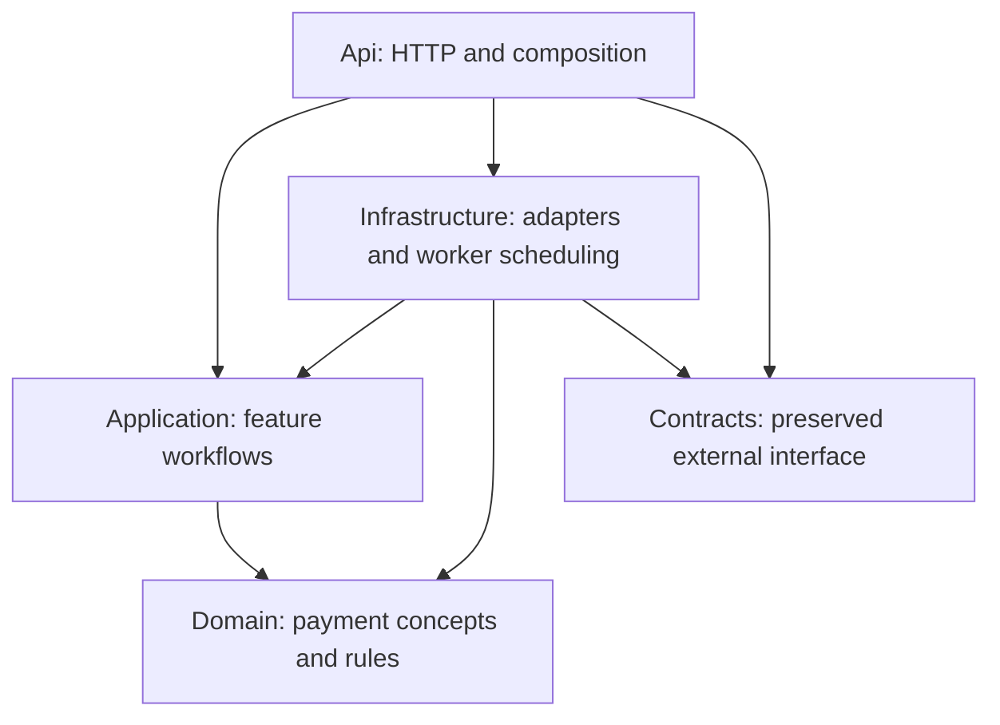

# Architecture

## One host, separate layers

The Api executable runs HTTP endpoints and, once implemented, the background workers. Separate libraries make dependency direction checkable without introducing a second deployment.

| Project | Direct project references | Owns |
|---|---|---|
| IPS.MiidleWear.Contracts | None | Existing public models, interfaces, route constants, metadata |
| IPS.Middleware.Domain | None | Payment concepts, invariants, transaction state transitions |
| IPS.Middleware.Application | Domain | Internal commands/results, feature workflows, external dependency interfaces |
| IPS.Middleware.Infrastructure | Application, Domain, Contracts | EF/SQL, XML, signing/TLS, HTTP adapters, telemetry, hosted scheduling |
| IPS.Middleware.Api | Application, Infrastructure, Contracts | HTTP mapping, configuration, dependency registration |
| IPS.Middleware.Tests | Application, Domain, Contracts; Api as a build dependency only | Domain/application behavior, compatibility, and evaluated dependency tests |
| IPS.Middleware.IntegrationTests | Api, Infrastructure, Application, Domain | Host and SQL persistence tests; later independent protocol simulators |

Contracts uses only the base class library. Domain additionally allows the centrally pinned Stateless 5.20.1; its types remain private to transition implementation. Application may resolve Stateless transitively through Domain but declares no direct external package dependency. Application also has no external packages in the foundation. A future pure-library dependency needs a reviewed rule change; ASP.NET, EF Core, HTTP clients, hosting, signing, and telemetry implementations remain outside Application.

Transitive project references are disabled, so access to another project's types requires an explicit reference. Architecture tests inspect manifests produced from **evaluated MSBuild references**, including imported package/framework references and resolved non-framework assembly references. This catches changes hidden in build imports or direct DLL references rather than checking only visible project-file text. The generated reports are copied into test output as hidden build inputs; they do not appear as linked files in Solution Explorer.

## Feature ownership

Future folders follow the capability rather than a generic Services/Managers taxonomy:

- Application: payment submission, dispatch decisions, recovery, incoming handling, status delivery, recalls, initiations, proxy management.
- Domain: only concepts and rules those capabilities actually need. ISO XML models and database-only records belong in Infrastructure.
- Infrastructure: HTTP/core/IPS/proxy adapters, protocol encoding/parsing/signing, persistence, and Workers.
- Api: request/response translation and endpoint mapping.

Api converts external DTOs into application commands. Infrastructure converts application requests/results into the existing core-facing DTOs or IPS messages. Application does not reference Contracts, so external JSON details do not define the internal workflow.

Workers call application workflows; they do not own payment state or retry policy. Database state will be the durable source of pending work. Any in-memory wake-up mechanism is an optimization and must not become the only record of accepted work.

## Extension rule

Implement the first capability directly. Add a shared module when multiple implemented callers need the same behavior. Its interface should hide protocol or storage complexity and have meaningful tests through that interface. Avoid generic repositories and a mediation framework. AggregateRoot is the approved minimal base for identity and pending domain events; add concrete payment aggregates only with implemented capabilities.

## Decisions

- [Single executable host](adr/0001-single-host.md)
- [Preserved external contracts](adr/0002-contract-compatibility.md)

Infrastructure directly maps OutgoingPayment current state and stores full versioned JSON events alongside it; loading state never replays history. Scoped transaction/work repositories and an explicit unit of work share one EF context. The version-checked parent is written before events in one transaction. A preparation-only interceptor adds event rows; events are acknowledged after commit and failed scopes are discarded. Request JSON, rowversion, ownership, and scheduling remain Infrastructure metadata. Domain business methods enforce transitions; Application owns workflow decisions. The Api registers persistence and workers when payment processing arrives. See [ADR 0003](adr/0003-aggregate-events.md) and [the approved outbound stages](rebuild-plan.md).

## Shared persistence

Application/Abstractions/Persistence owns IUnitOfWork and general concurrency/uniqueness exceptions. Application/Repositories/Payments owns repository interfaces; workflow models remain with Transactions. Infrastructure/Repositories/Payments implements those interfaces. Infrastructure/UnitOfWork saves every tracked change through one scoped context and acknowledges AggregateRoot events after commit. DomainEventsInterceptor validates sequences and prepares event records; PaymentPersistenceInterceptor enforces ownership and immutable payment storage rules. Intake interprets duplicate references.

Mappings and interceptors live under Infrastructure/Persistence. TransactionDbContext retains its historical CLR identity so existing generated migrations are still discovered. It is the shared database context; ordinary tracked entities save through the same unit of work. Historical migration paths and the schema remain unchanged. See [the revision specification](specs/001e-shared-unit-of-work.md).
